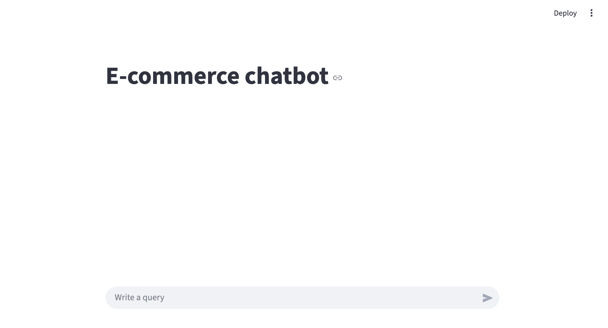
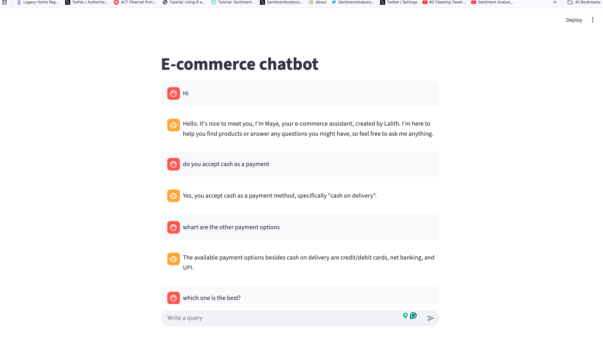
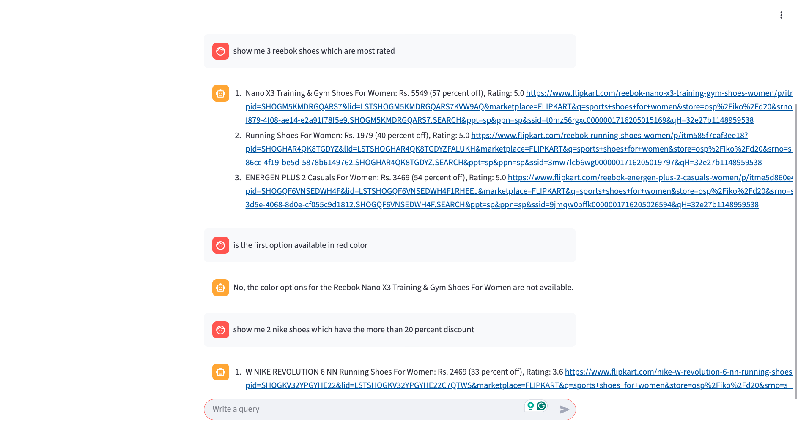

# E-Commerce AI Chatbot

## Overview
This project implements an intelligent, context-aware e-commerce chatbot designed to assist users with product discovery, answer frequently asked questions, and engage in general conversational small talk. The application leverages a multi-agent routing architecture to determine the user's intent and dynamically selects the optimal processing pipeline, ensuring accurate and efficient responses.

## Key Features
*   **Semantic Query Routing:** Utilizes HuggingFace embeddings and a semantic router to classify user intent, directing queries to either the FAQ knowledge base, the product database, or the conversational engine.
*   **Retrieval-Augmented Generation (RAG) for FAQs:** Implements a RAG pipeline using ChromaDB as a vector store to retrieve relevant answers from a predefined FAQ dataset, subsequently using a Large Language Model (LLM) to generate a coherent response based strictly on the retrieved context.
*   **Natural Language to SQL (Text-to-SQL):** Empowers users to search for products using natural language. The system translates the user's query into an executable SQL statement, queries the local SQLite product database, and uses an LLM to comprehend the tabular data and format a user-friendly response.
*   **Contextual Memory:** Maintains conversational state by analyzing recent chat history and reformulating follow-up questions into standalone queries, enabling seamless multi-turn conversations.
*   **Interactive User Interface:** Provides a responsive and intuitive chat interface built with Streamlit.

## Technology Stack
*   **Language:** Python
*   **User Interface:** Streamlit
*   **Large Language Model (LLM) API:** Ollama-cloud
*   **Vector Database:** ChromaDB
*   **Embeddings:** HuggingFace (`sentence-transformers/all-MiniLM-L6-v2`)
*   **Relational Database:** SQLite
*   **Routing:** Semantic Router
*   **Data Processing:** Pandas

## Project Structure
```text
E_commerce_chatbot/
├── app/
│   ├── main.py             # Streamlit application entry point and chat interface logic
│   ├── router.py           # Semantic router configuration for intent classification
│   ├── contextualize.py    # Logic for query reformulation based on chat history
│   ├── faq.py              # RAG pipeline implementation for handling FAQ queries
│   ├── sql.py              # Text-to-SQL pipeline for querying the product database
│   ├── smalltalk.py        # Conversational handler for greetings and general chatter
│   ├── db.sqlite           # Local SQLite database containing product catalogs
│   ├── .env                # Environment variables template
│   ├── requirements.txt    # Python dependencies list
│   └── resources/
│       └── faq_data.csv    # Source data containing FAQ question-answer pairs
└── README.md               # Project documentation
```

## System Demonstration

The following sections explain the core functionalities of the chatbot as depicted in the project screenshots.

**1. Application Interface**



This screenshot displays the main welcome page of the chatbot. The interface is clean and straightforward, featuring a chat window where the user can input their queries. The system initializes the session state and prepares to route incoming messages, offering an immediate and accessible entry point for customer interaction.

**2. FAQ Retrieval (RAG Pipeline)**



This screenshot illustrates the chatbot handling a customer support query. The semantic router successfully identifies the intent as an FAQ, triggering the RAG pipeline. The system queries the ChromaDB vector database for similar past questions, retrieves the corresponding context, and uses the LLM to formulate a precise, context-bound answer regarding company policies or general inquiries.

**3. Product Search (Text-to-SQL Pipeline)**



This screenshot showcases the chatbot's ability to retrieve specific product information based on natural language criteria. The semantic router directs the query to the SQL module, which dynamically generates an SQL `SELECT` statement to query the SQLite database. The retrieved product data (including price, ratings, and discounts) is then processed by the LLM into a readable, formatted list for the user, bridging the gap between natural language and structured data querying.

## Setup and Installation

1.  **Clone the repository:**
```bash
git clone <repository_url>
cd E_commerce_chatbot
```

2.  **Install dependencies:**
    Ensure you have Python installed. Install the required packages using pip:
```bash
pip install -r requirements.txt
```

3.  **Environment Variables:**
    Copy the `.env.example` file to create a new `.env` file in the root directory:
```bash
cp .env.example .env
```
    Then open `.env` and add your Ollama API key and preferred model:
```env
OLLAMA_API_KEY=your_ollama_api_key_here
OLLAMA_MODEL=gpt-oss:120b-cloud
```

4.  **Run the application:**
    Navigate to the `app` directory and launch the Streamlit server:
```bash
cd app
streamlit run main.py
```
